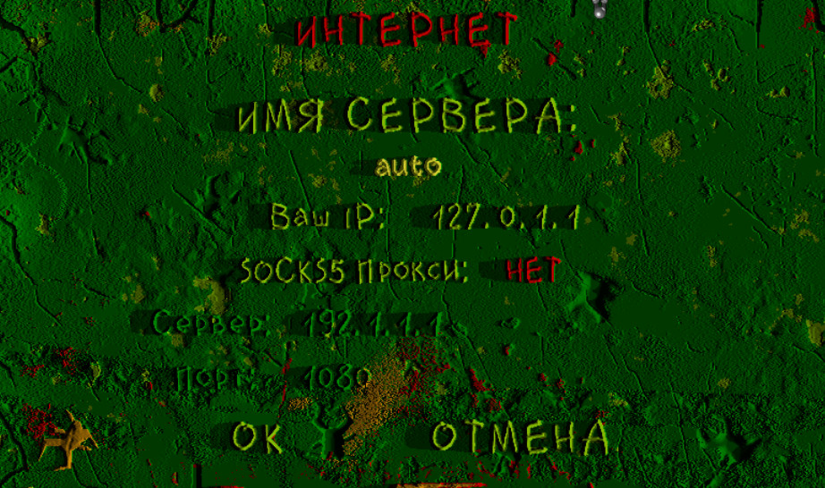

## Веб версия Вангеров

Экслюзивные права на публикацию Вангеров в интренете принадлежать компании [GamePix](https://gamepix.com). Тем не менее
я [[@caiiiycuk](mailto:caiiiycuk@gmail.com)] являюсь разработчиком веб версии Вангеров. Поэтому хочу рассказать о некоторых
скрытых возможностях этой версии.

**Дисклеймер**: Все что написано на этом сайте, это мое личное менение и ни как не отражает/не связано с позицией компании GamePix.

Браузерная версия доступна по этим ссылкам:
* [GamePix Vangers](https://gamepix.com/play/vangers)
* [Yandex](https://yandex.ru/games/play/152268)

Любую обратную связь лучше отправлять в публичный [трекер](https://github.com/caiiiycuk/vangers-web/issues) проекта.

## Обзорное видео

<iframe width="560" height="315" src="https://www.youtube.com/embed/8z0AY2N9SLk" title="YouTube video player" frameborder="0" allow="accelerometer; autoplay; clipboard-write; encrypted-media; gyroscope; picture-in-picture" allowfullscreen></iframe>

## Сетевой режим

Веб версия полностью поддерживает режим игры по сети, но он не включен по умолчанию. Этот режим является эксперементальным,
что бы им воспользоваться включите `Настройки -> Дополнения -> Сетевая Игра (Web)`. После этого вы сможете зайти или создать сетевую
игру, точно так же как и в обычной версии.

Для игры в браузере подойдет обычный сервер Вангеров. Однако, этот сервер должен уметь принимать `wss://` подключения.
[Инструкция по настройке сервера](https://github.com/KranX/Vangers/wiki/Starting-up-server-compatible-with-web-&-native-versions).

На данный момент только один сервер поддерживает веб версию `vangers.net`, для его использования **просто оставьте значение `auto` в
настройках игры**.

Обычная версия Вангеров тоже может использовать этот сервер, для этого укажите адрес `vangers.net` в игре.
[Рукводство](https://dmitriy-tolkunov.medium.com/multiplayer-vangers-c6cd3b9bee0f) для новичков от `@W_DimON`.

## Модели выского разрешения

Вы можете включить модели выского разрешения созданные [@John Tomson](https://vk.com/jtttfwtd?w=wall-192086280_321), для этого используйте
соответствующий пункт настроек в экране дополнений.

**ВАЖНО**: Активация данного режима потребует значительно большего объема скачиваемы данных для старта игры (порядка 85Мб вместо 35Мб).

## Community eXperiemtns (Cx)

[Cx](https://github.com/Aidoneus/Vangers) - великолепный мод расширяющий возможности сетевой игры можно включить в экране дополнений. Участвуйте в покатушках [сообщества Вангеров](https://t.me/vangers), что бы насладится новыми сетевыми режимами этого мода.

И это ещё не ВСЁ! Cx позволяет запускать новые миры созданные в редакторах SurMap и SurWeb участниками сообщества. 

## SURWEB

SurWeb - редактор SurMap портированный в браузер. С его помощью вы можете создавать свои миры и сразу же тестировать их в веб версии. На данный
момент редактор не очень интуитивный, но я надеюсь что он будет развиваться.

[Редактор SurWeb](https://caiiiycuk.github.io/vangers-web/surweb/index.html)

[Инструкция](https://youtu.be/UPOkIhhQa1Q) по использованию редактора SurWeb от `@caiiiycuk`.

[Инструкция](https://youtu.be/YzZesk81SnQ) по использованию редактора SurMap от `@dilesoft`.
